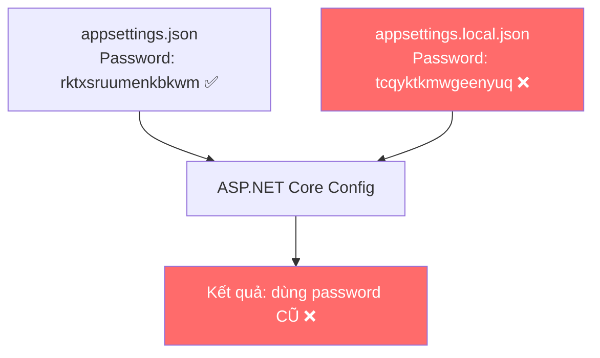

# 🔧 Tổng kết lỗi SMTP — 06/10/2026

## Triệu chứng chung

```
5.7.8 Username and Password not accepted (BadCredentials)
```
hoặc
```
Failure sending mail
```

Gửi mail trên **local** hoạt động bình thường, nhưng trên **server AWS EC2** thì liên tục thất bại.

---

## Lỗi 1: App Password hết hạn / bị thu hồi

| | |
|---|---|
| **Nguyên nhân** | App Password cũ `tcqyktkmwgeenyuq` đã bị Google thu hồi hoặc hết hạn |
| **Giải pháp** | Tạo App Password mới tại [myaccount.google.com/apppasswords](https://myaccount.google.com/apppasswords) |
| **Password mới** | `rktx sruu menk bkwm` (bỏ dấu cách khi dùng) |

> [!IMPORTANT]
> App Password chỉ hiển thị **1 lần duy nhất** khi tạo. Cần lưu lại ngay.

---

## Lỗi 2: `appsettings.local.json` trên server ghi đè password đúng

Đây là **lỗi chính gây mất cả buổi chiều**.

### Cơ chế



**ASP.NET Core load config theo thứ tự:**
1. `appsettings.json` → password mới ✅
2. `appsettings.{Environment}.json` (nếu có)
3. `appsettings.local.json` → **password cũ ghi đè** ❌
4. Environment variables
5. Command line args

> **Config load sau luôn ghi đè config trước** — nên `appsettings.local.json` chứa password cũ sẽ "thắng".

### Tại sao xảy ra?

| Bước | Chuyện gì xảy ra |
|------|-------------------|
| Trước deploy | Sửa tay `appsettings.json` trên server → **hoạt động** (vì `local.json` chưa tồn tại hoặc đã xóa) |
| Sau `git pull` + deploy | Script deploy copy `appsettings.local.json` cũ lại server → **ghi đè password đúng** |

### Cách fix

```powershell
# Xóa file override cũ trên server
Remove-Item C:\Apps\InternLink\Api\appsettings.local.json -Force

# Restart IIS
Restart-WebAppPool -Name 'InternLinkApi'
```

---

## Lỗi 3: Thư mục `uploads/` không có trên server

| | |
|---|---|
| **Nguyên nhân** | `.gitignore` bỏ qua `uploads/`, nên `git push/pull` không bao gồm thư mục này |
| **Ảnh hưởng** | Client upload file sẽ lỗi nếu thư mục chưa tồn tại |
| **Giải pháp** | Đã thêm bước tự tạo `uploads/` trong deploy script |

---

## Những thay đổi đã thực hiện

### 1. Deploy Script ([update-windows-server.ps1](file:///e:/Downloads/InternLink/scripts/update-windows-server.ps1))
- `appsettings.local.json` giờ là **optional** — không có cũng không lỗi
- Tự tạo thư mục `uploads/documents`, `uploads/submissions`, `uploads/weekly-reports` trên server
- Cấp quyền ghi cho IIS AppPool

### 2. Auth Flow ([AuthService.cs](file:///e:/Downloads/InternLink/backend/InternLink/InternLink.Infrastructure/Services/AuthService.cs))
- Kiểm tra email tồn tại trước khi gửi mail reset password
- Trả lỗi rõ ràng thay vì âm thầm thành công

### 3. API Error Handling ([AuthController.cs](file:///e:/Downloads/InternLink/backend/InternLink/InternLink.API/Controllers/AuthController.cs))
- `404` — Email không tồn tại
- `502` — Gửi mail thất bại (SMTP error)
- `400` — Dữ liệu không hợp lệ

---

## ⚠️ Lưu ý quan trọng cho lần deploy sau

### Checklist deploy

- [ ] **Kiểm tra `appsettings.local.json`** trên server — xóa nếu không cần thiết
- [ ] **Dùng deploy script** (`update-windows-server.ps1`) thay vì deploy tay — script xử lý đúng logic override
- [ ] **Nếu deploy tay** (`git pull` + restart), nhớ kiểm tra:
  ```powershell
  # Xem password nào đang được dùng
  Get-Content C:\Apps\InternLink\Api\appsettings.json | Select-String "Password"
  Get-Content C:\Apps\InternLink\Api\appsettings.local.json -ErrorAction SilentlyContinue | Select-String "Password"
  ```

### Khi tạo App Password mới

1. Đăng nhập [myaccount.google.com/apppasswords](https://myaccount.google.com/apppasswords) bằng đúng tài khoản `internlink.cntt@gmail.com`
2. Đảm bảo **bật xác minh 2 bước** (2FA) — App Password không hoạt động nếu 2FA tắt
3. Copy password 16 ký tự → cập nhật vào `appsettings.json` (bỏ dấu cách)
4. **Xóa** `appsettings.local.json` trên server nếu tồn tại
5. Restart: `Restart-WebAppPool -Name 'InternLinkApi'`

### Test nhanh SMTP trên server

```powershell
# Kiểm tra kết nối
Test-NetConnection smtp.gmail.com -Port 587

# Xem log gửi mail
Get-Content C:\Apps\InternLink\Api\Logs\log-*.txt -Tail 20 | Select-String -Pattern "email|smtp|mail" -CaseSensitive:$false
```
